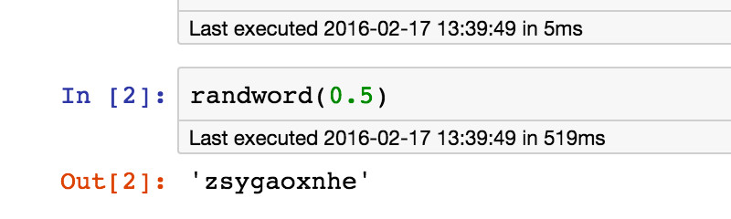
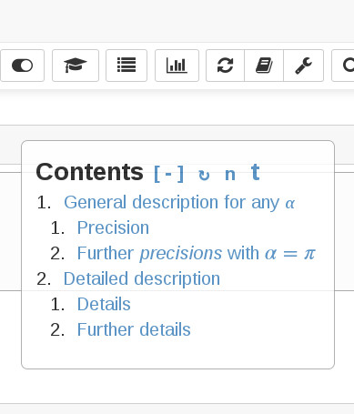
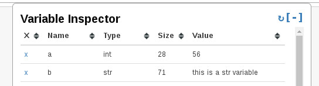
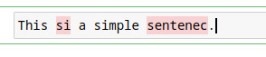
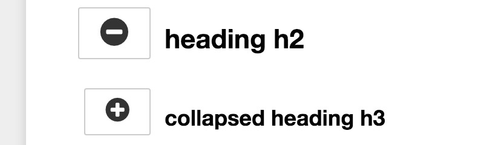

# Jupyter Notebook

This page contains tips for Jupyter Notebook.

## Notebook extensions

It's require to install [jupyter_contrib_nbextensions](https://jupyter-contrib-nbextensions.readthedocs.io/en/latest/install.html):

```shell
pip install jupyter_contrib_nbextensions
```

and after that install extensions

```shell
jupyter contrib nbextension install --user
```

Useful extensions:
- ExecuteTime - display when each cell has been executed and how long it took
  -  
- Table of Contents (2) - `toc2` extension enables to collect all running headers and display them in a floating window, as a sidebar or with a navigation menu
  - 
- Variable Inspector - Variable Inspector extension collects all defined variables and display them in a floating window
  - 
- spellchecker - Simple spellchecking
  - 
- Code prettify - Use kernel-specific code to reformat/prettify the contents of code cells
- Collapsible Headings - Allows notebook to have collapsible sections, separated by headings
  - 
